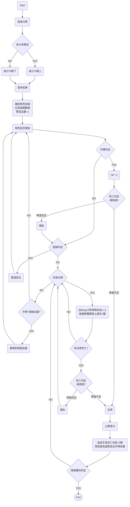

# Bang!
`Programming II final project from Team03`


## Overview
This is a text-adventure-like replica of board game `BANG!`. This game is a standalone, so you don't have to find friends to experience the fun of this board game!
## Team Member
- 40711013E 林亮均
- 40611010E 陳柔諭
- 40547022S 許欣平


## Team Work

|組員|分工比率|概要|
|:---:|:---:|:---:|
|林亮均|34%|主要遊戲架構、物件型別建立、Debug|
|陳柔諭|33%|遊戲架構支援、角色能力、物件型別建立、Debug|
|許欣平|33%|遊戲架構支援、道具效果、物件型別建立、Debug|

## How To Play

Open the terminal and input command:

`make`

There! You can play it on your terminal! :)
4 players only.


## Game Rules

### Game pieces

#### Role
- There are 4 roles.
- Different roles have different goals to win the game.
- |Role |Win Condition|
  |:---:|:-----------:|
  |Sheriff|Kill all the outlaws and renegades|
  |Vice|Kill all the outlaws and renegades|
  |Outlaw|Kill the sheriff|
  |Renegade|Be the only one alive|


#### Character
- There are 16 characters. Each of them have special abilities.
- |Name|Ability|
  |:---:|:---|
  |Bart Cassidy|Each time he loses a life point, he immediately draws a card from the deck.|
  |Black Jack|During drawing phase of his turn, he must show the second card he draws. If it's Heart or Diamond, he draws one additional card without revealing it.|
  |Calamity Janet`(NOT WORKING)`|She can use [Bang!] cards as [Missed!] cards and vice versa. If she plays a [Missed!] as a [Bang!], she cannot play another [Bang!] card that turn unless she has a [Volcanic] in play.|
  |El Gringo|Each time he loses a life point due to a card played by another player, he draws a random card from the hands of that player. Note that [Dynamite] damages are not caused by any player.|
  |Jesse Jones|During drawing phase of his turn, he may choose to draw the first card from the deck, or randomly from the hand of any other player. Then he draws the second card from the deck.|
  |Jourdonnais`(NOT WORKING)`|He is considered to have a [Barrel] in play at all times; he can draw when he is the target of a [Bang!], and on a Heart he is missed. If he has another real [Barrel] card in play, he can count both of them, giving him two chances to cancel the [Bang!] before playing a [Missed!].|
  |Kit Carlson|During drawing phase of his turn, he looks at the top three cards of the deck. He chooses 2 to draw, and puts the other one back on the top of the deck, face down.|
  |Lucky Duke|Each time he is required to draw, he flips the top two cards from the deck and chooses the result he prefers. Discard both cards afterward.|
  |Paul Regret|He is considered to have a [Mustang] in play at all times; all other players must add 1 to the distance to him. If he has another real [Mustang] in play, he can count both of them, increasing all distances to him by a total of 2.|
  |Pedro Ramirez|During drawing phase of his turn, he may choose to draw the first card from the top of the discard pile or from the deck. Then, he draws the second card from the deck.|
  |Rose Doolan|She is considered to have a [Scope] in play at all times; she sees other players at a distance decreased by 1. If she has another real [Scope] in play, she can count both of them, reducing her distance to all other players by a total of 2.|
  |Sid Ketchum`(NOT WORKING)`|At any time, he may discard 2 cards from his hand to regain one life point. If he is willing and able, he can use this ability more than once at a time.|
  |Slab the Killer|Players trying to cancel his [Bang!] cards need to play 2 [Missed!]. The [Barrel] effect, if successfully used, only counts as one [Missed!].|
  |Suzy Lafayette`(NOT WORKING)`|As soon as she has no cards in her hand, she draws a card from the draw pile.|
  |Vulture Sam|Whenever a character is eliminated from the game, he takes all the cards that player had in his hand and in play, and adds them to his hand.|
  |Willy the Kid|He can play any number of [Bang!] cards during his turn.|

#### Cards
- |     中文     |     英文      |  張數   |  類別  |
  |:------------:|:-------------:|:-----:|:------:|
  |     砰！     |     Bang!     | 25  | 消耗品 |
  |    失手！    |    Missed!    | 12 | 消耗品 |
  |  格林機關槍  |    Gatling    |  1   | 消耗品 |
  |   印地安人   |    Indians    | 2 | 消耗品 |
  |    驚慌！(NOT WORKING)    |    Panic!     | 4 | 消耗品 |
  |  凱特．巴洛  |   Cat Balou   | 4 | 消耗品 |
  |    驛馬車    |  Stagecoach   | 2 | 消耗品 |
  | 威爾斯．法歐 |  Wells Fargo  |  1   | 消耗品 |
  |    雜貨店(NOT WORKING)    | General Store | 2 | 消耗品 |
  |     啤酒     |     Beer      | 6 | 消耗品 |
  |     酒館     |    Saloow     |  1   | 消耗品 |
  |     決鬥     |     Duel      | 3 | 消耗品 |
  |    啤酒桶`(NOT WORKING)`   |    Barrel     | 2 |  裝備  |
  | 望眼鏡瞄準器 |     Scope     |  1   |  裝備  |
  |     野馬`(NOT WORKING)`    |    Mustang    | 2 |  野馬  |
  |     監獄     |     Jail      | 2 |  裝備  |
  |     炸藥`(NOT WORKING?)`    |    Dynamic    |  1   |  裝備  |
  |    連發槍`(NOT WORKING)`    |   Volcanic    | 2 |  武器  |
  |  史考菲爾德`(NOT WORKING)`  |   Schofield   | 3 |  武器  |
  |    雷明頓`(NOT WORKING)`    |   Remington   |  1   |  武器  |
  |    卡賓槍`(NOT WORKING)`    | Rev.Carabine  |  1   |  武器  |
  |   溫徹斯特`(NOT WORKING)`   |  Winchedter   |  1   |  武器  |

### Basic Game Flowchart


## Code Overview

### Structure

README.md  
Bang/  
├─ Makefile  
├─ main  
├─ ability  
├─ board  
├─ card  
├─ character  
├─ mustang  
├─ player  
├─ role  
├─ weapon

### Object

- 玩家：Player
	```c
	typedef struct{
		int id;
		int BoardNum;
		card *CardinHand;
	} Player;
	```
- 遊戲板：Board
	```c
	typedef struct{
		int id;
		int hp;
		Role role;
		Weapon weapon;
		Mustang mustang;
		bool isScope;
		bool isBarrel;
		bool isJail;
		bool isBomb;
	} Board;
	```
- 角色：Character
	```c
	typedef struct{
		char *name;
		int hp;
		char *ability;
	} Character;
	```
- 身分：Role
	```c
	typedef struct{
		char *roleName;
		char *object;
	} Role;
	```
- 卡牌： Card
	```c
	typedef struct Card{
		char suit[20];
		int number;
		char type[20];
		char name[20];
		char ability[20];
		int (*func)(Board board[],struct Card *set[],int user,int enemy,struct Card *deck,
			struct Card *deadwood,int number);
		struct Card *next;
	}card;
	```
- 武器：Weapon
	```c
	typedef struct{
		int weaponId;
		int attackDistance;
		bool isVolcanic;
	} Weapon;
	```
- 野馬：Mustang
	```c
	typedef struct{
		int mustangId;
	} Mustang;
	```
### Ability
- 能力：Character Ability
	```c
	void _<character_name>_ {
          ...
	}
	```
- 消耗：Item
	```=c
	int <item_name> {
	 ...
	}
	```


## Work Log
#### 6/11
- Team work:
  - 許：LinkedList
  - 陳：Game Rules
  - 林：Object Definement
#### 6/13
- 1st Meeting @ school

#### 6/14
- Plan out Basic Outline

#### 6/15

- 規則 Flow Chart
- Structure Building:
  - `玩家` : player
  - `遊戲板`：board
  - `身分`：role
  - `武器`：weapon
  - `野馬`：mustang
  - `角色`：character
  - `角色距離`：distance
- Main Game Building:
  - Player Setting

#### 6/17
- Structure Building:
   - `Card`
 - Main Game Building:
   - Stat Setting and basic game rule outline

#### 6/18

- Change Game Flowchart
- Debugging
- Structure Building:
   - `Equips`
   - `Item`

#### 6/19
- Debugging
- Main Game Building:
  - Character abilitty realisation
  - Item realisation 
